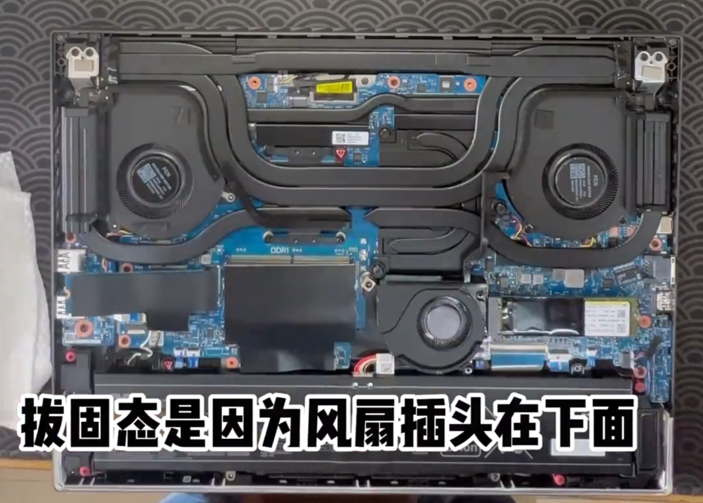
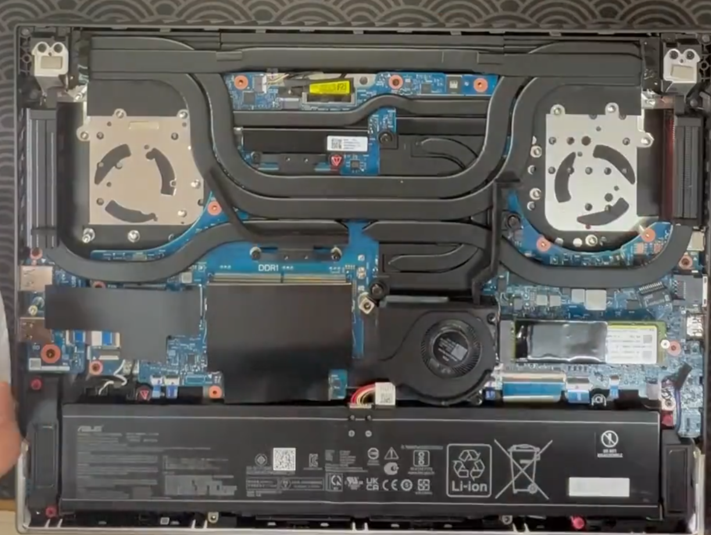
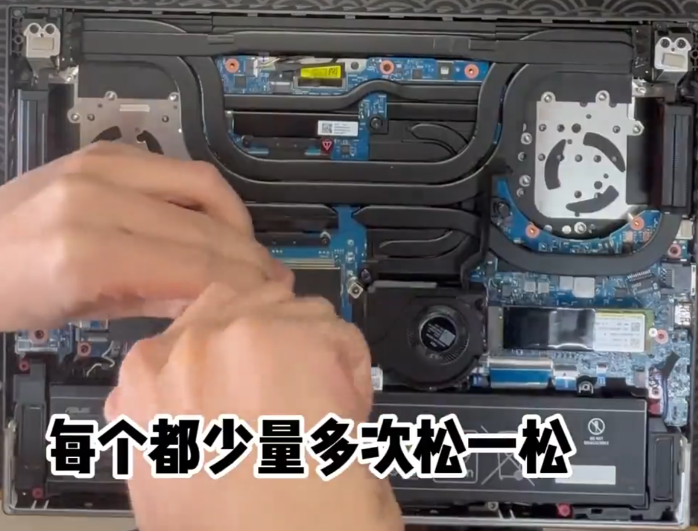
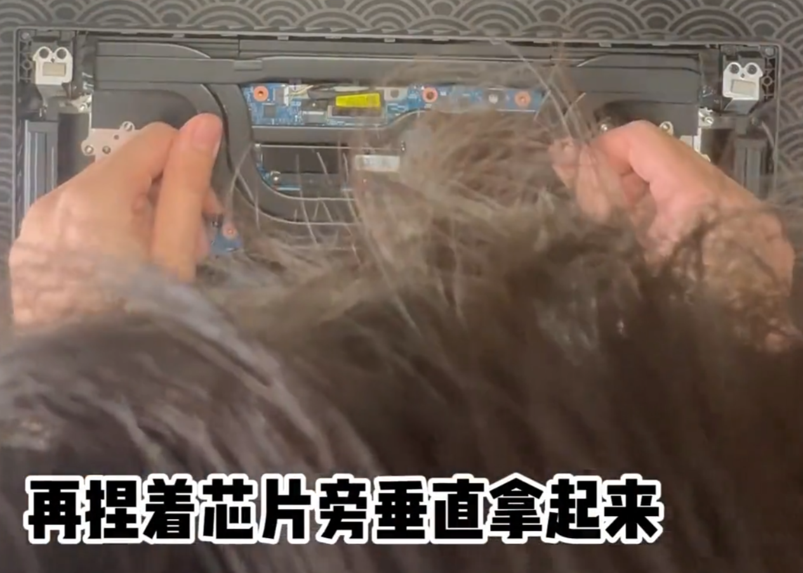
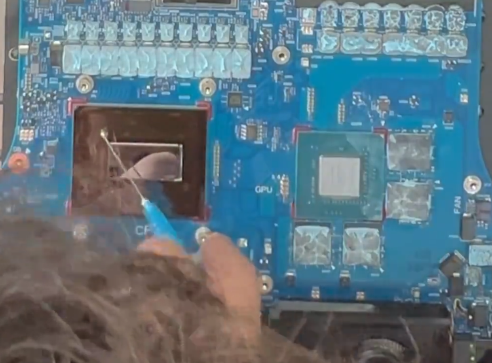
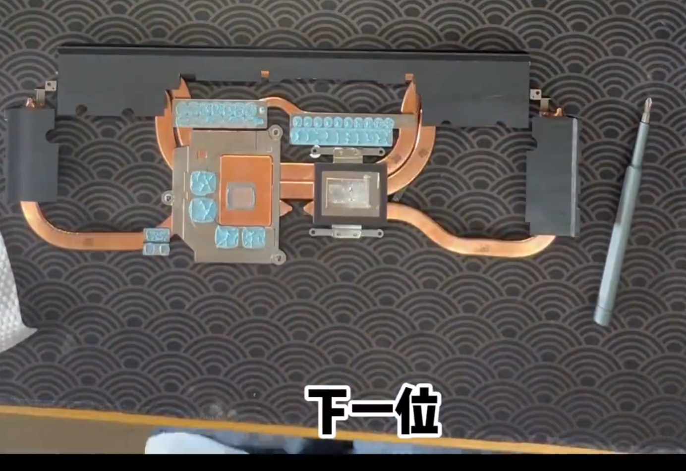
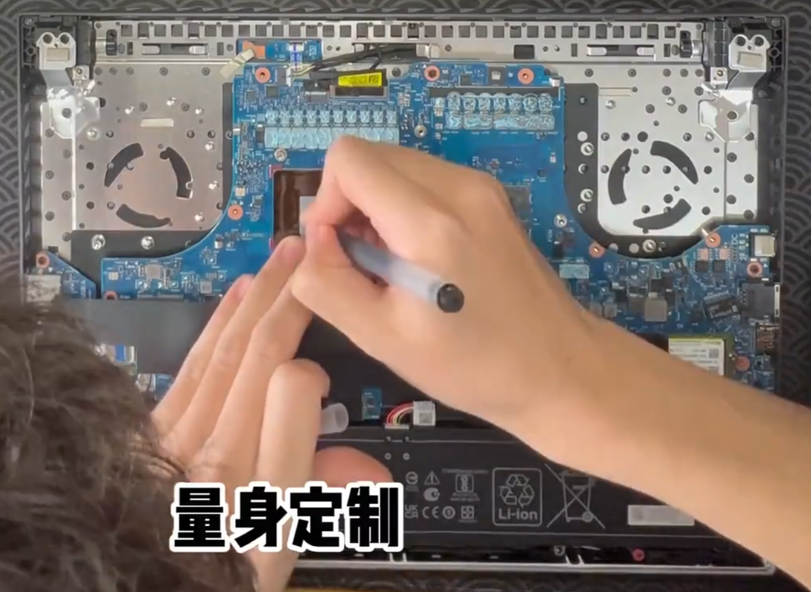

# ROG枪神8清灰换相变片——预习篇

## step1：拆除D面
拧下螺丝即可

## step2：拆风扇

要把固态拔了，风扇插头在下面

把风扇拿掉

## step3：拆热管

热管螺丝有点紧，要多松松

拆热管前先晃一晃，然后捏着芯片旁边垂直拿起来

## step4：清理CPU液金和显卡硅脂
准备棉签、酒精、针管
用棉签蘸酒精清理核心表面，再用针管吸走

记得导热管上也要擦

## step5：贴相变片
拿出准备好的相变片，根据核心大小确定用量

放上去轻轻按一按就好

## step6：收尾
将导热管盖回去，拧上螺丝。
把风扇装回去，拧上螺丝接上电源。
拧螺丝还是少量多次。
把固态装回去，盖上盖子，祈求奇迹。
